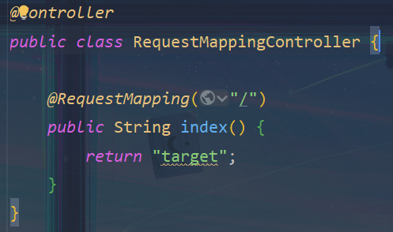

# @RequestMapping注解


## 功能

将请求和处理请求的控制器关联起来，建立起映射关系

SpringMVC接收到相应的请求，就会找到对应的请求控制器来处理这个请求

**注意：**

当有多个`@RequestMapping`处理一个请求路径时，此时SpringMVC无法知道具体使用哪个请求处理器处理请求

进而报错





## 位置

`@RequestMapping`注解，可放到*类*、*方法*上

- 放到类上：表示映射请求路径的**初始信息**
- 放到方法上：表示映射请求路径的**具体信息**

```java
@Controller
@RequestMapping("/test") // 设置映射请求的初始信息
public class RequestMappingController {
    
    @RequestMapping("/testRequestMapping") // 设置请求路径的具体信息
    public String success() {
        return "success";
    }
}
```

具体的实现场景：

- 请求学生信息，请求班级信息

  ```
  - /students
  	- /list
  	- /...
  - /classes
  	- /list
  	- /...
  ```

  - 如果不使用类的映射请求，就会导致同一请求，多个请求控制器处理

    最终使得程序出错

  - 此时，就需要使用类映射请求控制器

    ```java
    @Controller
    @RequestMapping("/students")
    public class StudentsController {
        
        @RequestMapping("/list")
        public String success() {
            return "success";
        }
    }
    ```

    